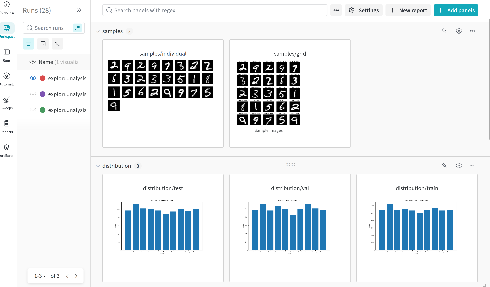
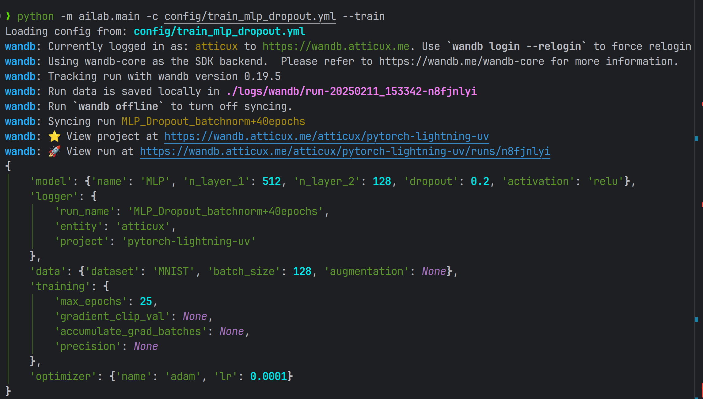
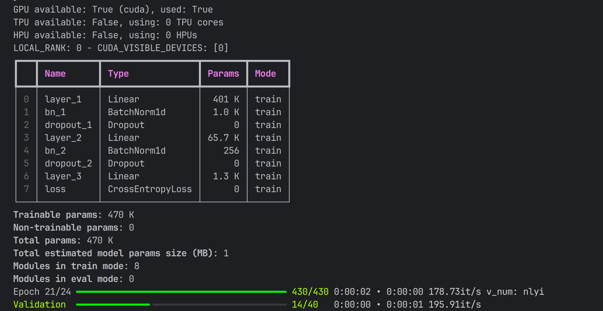
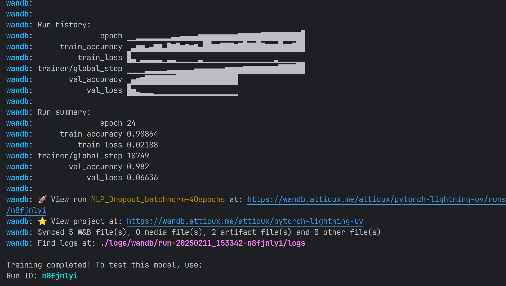
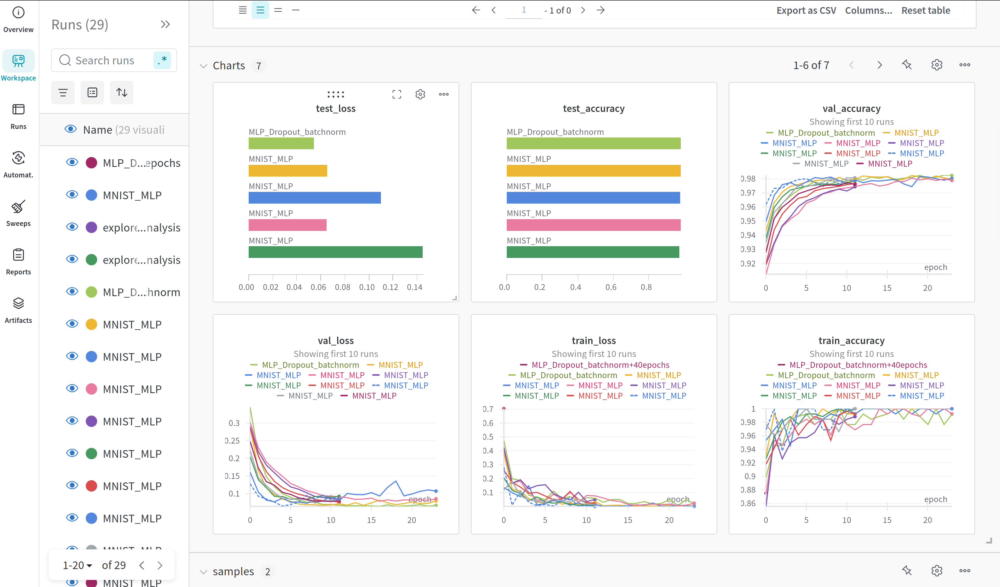
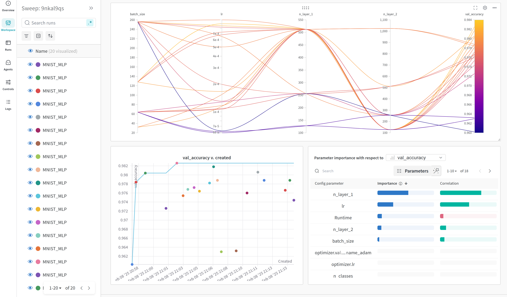

<div align="center">

# 🧪 Pytorch Lightning UV Template

A modern Deep Learning experiment template with PyTorch Lightning

[](https://www.python.org/downloads/release/python-310/)
[](https://pytorch.org/get-started/locally/)
[](https://lightning.ai/)
[](https://github.com/astral-sh/ruff)
[](https://github.com/ashleve/lightning-hydra-template#license)
[](https://github.com/AtticusZeller/Pytorch-Lightning-uv/pulls)

Click on [<kbd>Use this template</kbd>](https://github.com/AtticusZeller/Pytorch-Lightning-uv/generate) to initialize new repository.

</div>

## ✨ Features

* 🚀 **UV Environment Management** - Fast and efficient dependency management
* 🎯 **Typer CLI** - Modern command line interface
* ⚙️ **YAML Config** - Flexible experiment configuration
* 🔋 **Lightning Components**
  + DataModule for clean data handling
  + Model with built-in training logic
  + Trainer with all the bells and whistles
* 📊 **Weights & Biases Integration**
  + Experiment tracking and visualization
  + Hyperparameter optimization with sweeps
  + Dataset analysis and exploration
* 🎨 **Clean Project Structure**
  + Modular and maintainable codebase
  + Easy to extend and customize

## 🛠️ Installation

```bash
# install dependencies
uv sync --dev
# install project as a package
uv pip install -e .
```

> [!note]
> 1. remember to replace `your_wandb_entity` with your actual W&B entity in the config files and `config.py`
> 2. `uv run` before bash scripts to ensure the environment is activated

## 📊 Dataset Analysis

Explore and analyze your dataset with built-in EDA tools:

```bash
python -m expt.main -c config/resnet.yml --eda
```

<details>
<summary>📈 View EDA Example</summary>



</details>

## 🚀 Training

Start training your model with a single command:

```bash
python -m expt.main -c config/resnet.yml --train
```

<details>
<summary>🔍 View Training Details</summary>

### Configuration Overview



### Training Progress



### Training Summary



### W&B Dashboard



</details>

## 📊 Evaluation

Evaluate your trained model:

```bash
python -m expt.main -c config/resnet.yml --eval --run-id n8fjnlyi
```

<details>
<summary>📊 View Evaluation Results</summary>


</details>

## 🎛️ Hyperparameter Tuning

Optimize your model with W&B Sweeps:

```bash
python -m expt.main -c config/resnet.yml --sweep --sweep-config config/sweep/mlp.yml
```

<details>
<summary>📈 View Sweep Results</summary>



</details>

## 📝 License

This project is licensed under the MIT License - see the [LICENSE](LICENSE) file for details.

## 🙏 Acknowledgements

* [PyTorch Lightning](https://lightning.ai/)
* [Weights & Biases](https://wandb.ai/)
* [Typer](https://typer.tiangolo.com/)
* [UV](https://github.com/astral-sh/uv)

---

<div align="center">
Made with ❤️ for the ML community
</div>
